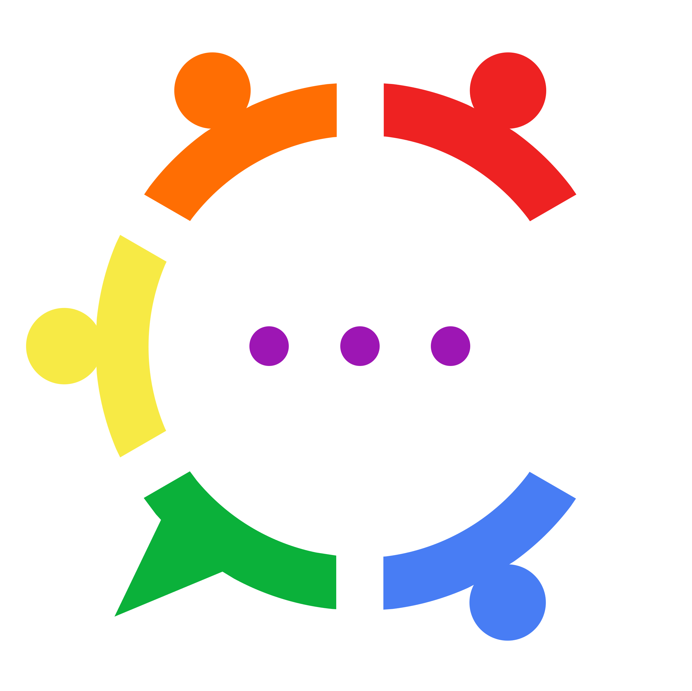
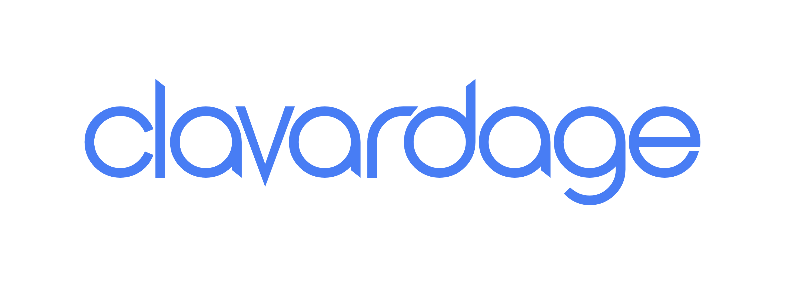

# CLAVARDAGE

<!-- PROJECT LOGO -->
<br />
<p align="center">
  <a href="https://github.com/Clavardage/clavardage">
    
  </a>

<h3 align="center"><a href="https://github.com/Clavardage/clavardage"></a></h3>

  <p align="center">
    Clavardage: A decentralized chat
    <br />
    <a href="https://github.com/Clavardage/clavardage/releases"><strong>See Releases »</strong></a>
    <br />
    <br />
    <a href="https://github.com/Clavardage/clavardage/wiki">Read the wiki</a>
    ·
    <a href="https://github.com/Clavardage/clavardage/issues">Issues</a>
    ·
    <a href="https://insa-clavardage.atlassian.net/jira/software/projects/CLAV/boards/1">Show JIRA Project</a>
  </p>

<!-- TABLE OF CONTENTS -->
<details open="open">
  <summary>Table of Contents</summary>
  <ol>
    <li>
      <a href="#about-the-project">About The Project</a>
      <ul>
        <li><a href="#built-with">Built With</a></li>
      </ul>
    </li>
    <li>
      <a href="#getting-started">Getting Started</a>
      <ul>
        <li><a href="#prerequisites">Prerequisites</a></li>
        <li><a href="#installation">Installation</a></li>
      </ul>
    </li>
    <li>
      <a href="#usage">Usage</a>
      <ul>
        <li><a href="#execution">Execution</a></li>
        <li><a href="#generation">Generation</a></li>
        <ul>
           <li><a href="#documentation">Documentation</a></li>
           <li><a href="#jar-archive">JAR Archive</a></li>
           <li><a href="#executable-optional">Executable (optional)</a></li>
        </ul>
      </ul>
    <li><a href="#tree-structure">Tree Structure</a></li>
    <li><a href="#credits">Credits</a></li>
    <li><a href="#contact">Contact</a></li>

  </ol>
</details>

***

<!-- ABOUT THE PROJECT -->
## About The Project


### Built With
* [Java OpenJDK](https://openjdk.java.net/)
* [SQLite](https://sqlite.org/)

<!-- GETTING STARTED -->
## Getting Started

### Prerequisites

* Install a Java OpenJDK version 17.

> :warning: **In order to create an local executable (optional)** : Other programs will have to be manually installed depending on the target OS (see <a href="#executable-optional">Executable (optional)</a>).


### Installation

1. Clone the project
   ```sh
   git clone https://github.com/Clavardage/clavardage.git
   ```
2. Clavardage is now ready to run.

<!-- USAGE EXAMPLES -->
## Usage

### Execution

Use the following script in the project root to launch Clavardage :
  ```sh
  gradlew run
  ```

### Generation

To generate the Javadoc and the JAR archive, launch the following script :
  ```sh
  gradlew build
  ```

#### Documentation

During the build Clavardage uses a Gradle script to generate the Javadoc which can be found in the following location: `clavardage/build/docs`.
The script can be run separately from the build:
  ```sh
  gradlew javadoc
  ```

#### JAR Archive

A Gradle script is also used during the build to generate the JAR archive which can be found at the following location: `clavardage/build/libs`.
The script can be run separately from the build:
  ```sh
  gradlew jar
  ```
This archive is independent and can be distributed on any system running a Java OpenJDK 17 using the following command:
  ```sh
  java -jar clavardage-0.3.0.jar
  ```

#### Executable (optional)

Finally a last Gradle script can be used after the build to create an executable compatible with the local OS (with the help of the `jpackage` tool) which can be found at this location: `clavardage/build/dist`.
The script to run is the following:
  ```sh
  gradlew jpackage
  ```

> :warning: **To carry out this step you must have the following programs depending on the OS used** :
> * Linux: deb, rpm:
>    * For Red Hat Linux, the rpm-build package is required.
>    * For Ubuntu Linux, the fakeroot package is required.
> * macOS: pkg, app in a dmg
>    * Xcode command line tools are required when the --mac-sign option is used to request that the package be signed, and when the --icon option is used to customize the DMG image.
> * Windows: exe, msi
>    * WiX 3.0 or later is required.

***

<!-- TREE STRUCTURE -->
## Tree Structure
<details>

_TODO_

</details>

<!-- CREDITS -->
## Credits

Romain Monier [ [GitHub](https://github.com/rmonier) ] – Co-developer
<br>
Célestine Paillé [ [GitHub](https://github.com/clestinepa) ] – Co-developer

<!-- CONTACT -->
## Contact

Project Link : [https://github.com/Clavardage/clavardage](https://github.com/Clavardage/clavardage)
